# Golett AI - Architecture Diagrams

## Overview

This document provides visual representations of Golett AI's architecture, including system diagrams, data flow charts, and component relationships.

## Table of Contents

1. [High-Level System Architecture](#high-level-system-architecture)
2. [Memory Layer Architecture](#memory-layer-architecture)
3. [Knowledge Management Flow](#knowledge-management-flow)
4. [Agent Coordination Flow](#agent-coordination-flow)
5. [Data Flow Diagrams](#data-flow-diagrams)
6. [Deployment Architecture](#deployment-architecture)
7. [Security Architecture](#security-architecture)
8. [Component Interaction Diagrams](#component-interaction-diagrams)

---

## High-Level System Architecture

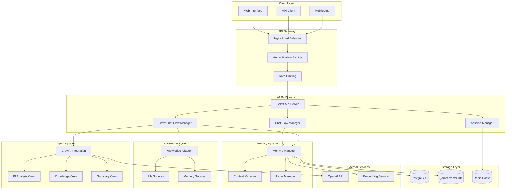

---

## Memory Layer Architecture

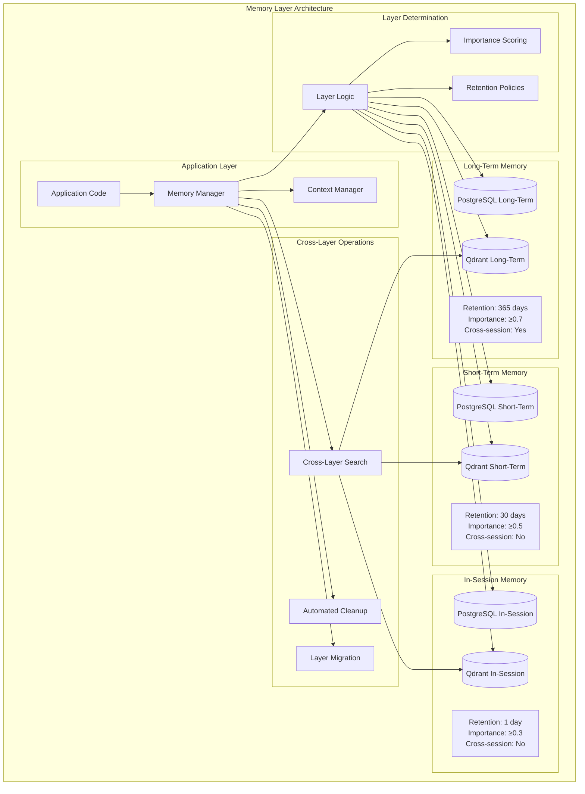

### Layer Key Generation Strategy

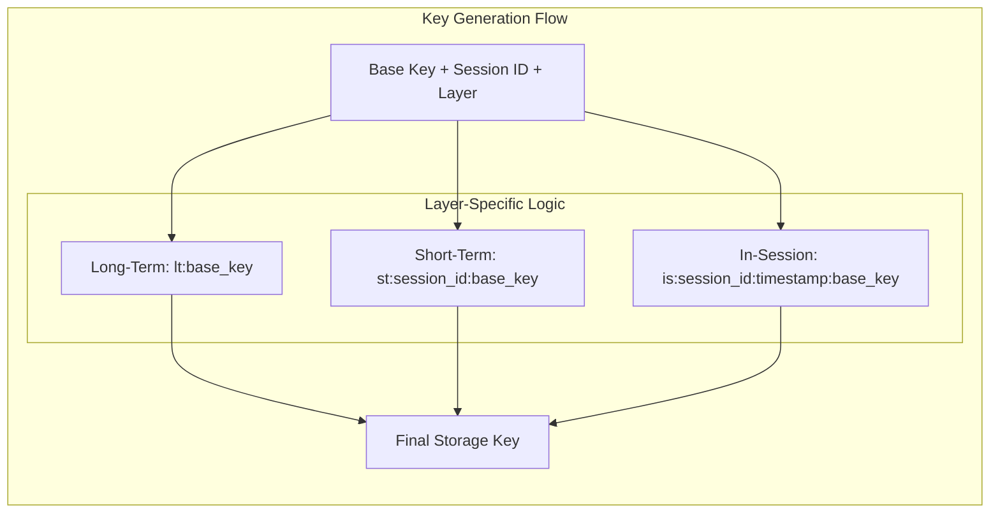

---

## Knowledge Management Flow

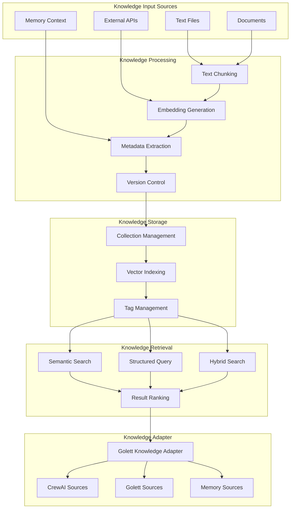

### Knowledge Retrieval Strategies

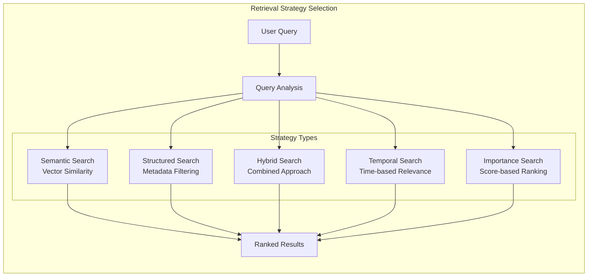

---

## Agent Coordination Flow

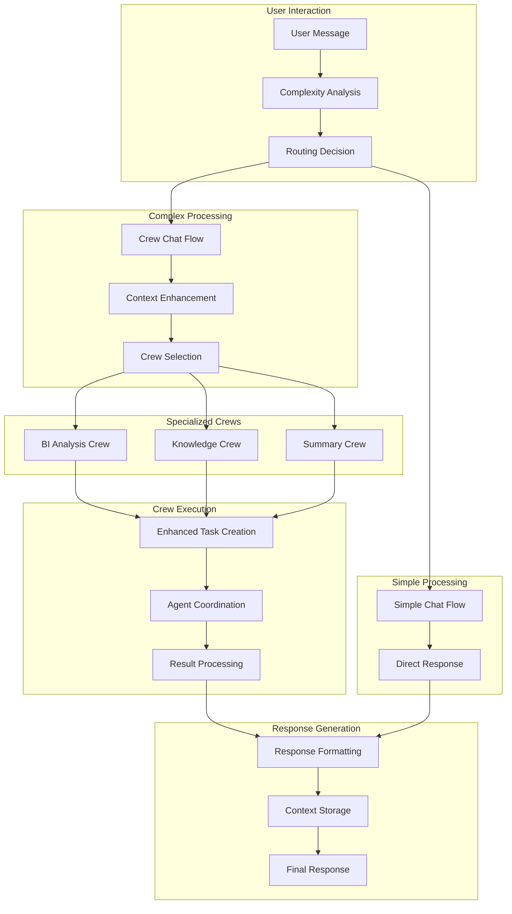

### Crew Specialization Matrix

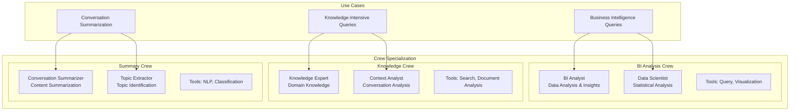

---

## Data Flow Diagrams

### Message Processing Flow

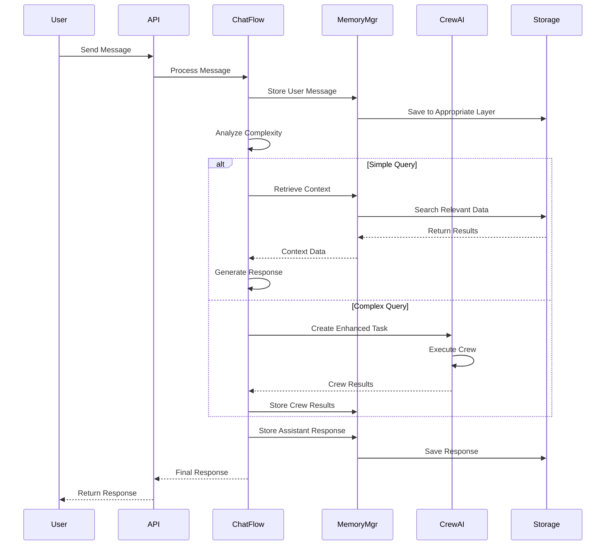

### Knowledge Retrieval Flow

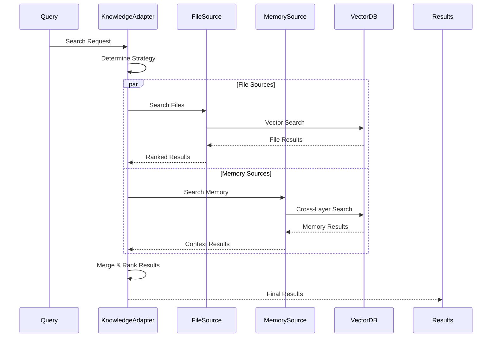

### Memory Layer Migration Flow

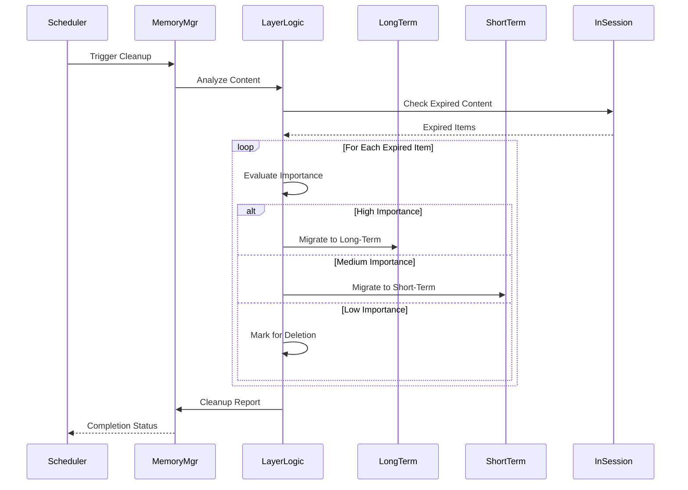

---

## Deployment Architecture

### Container Architecture

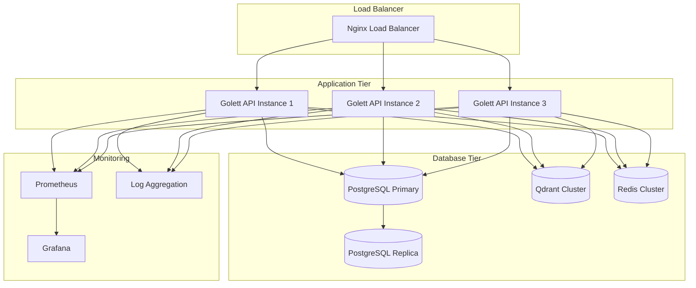

### Kubernetes Deployment

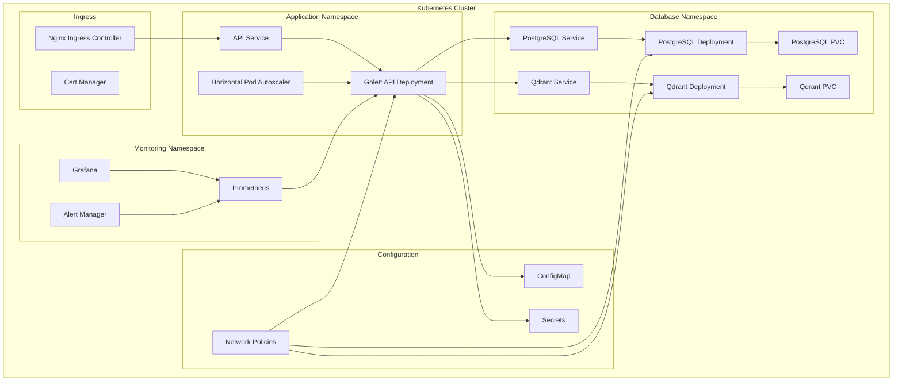

---

## Security Architecture

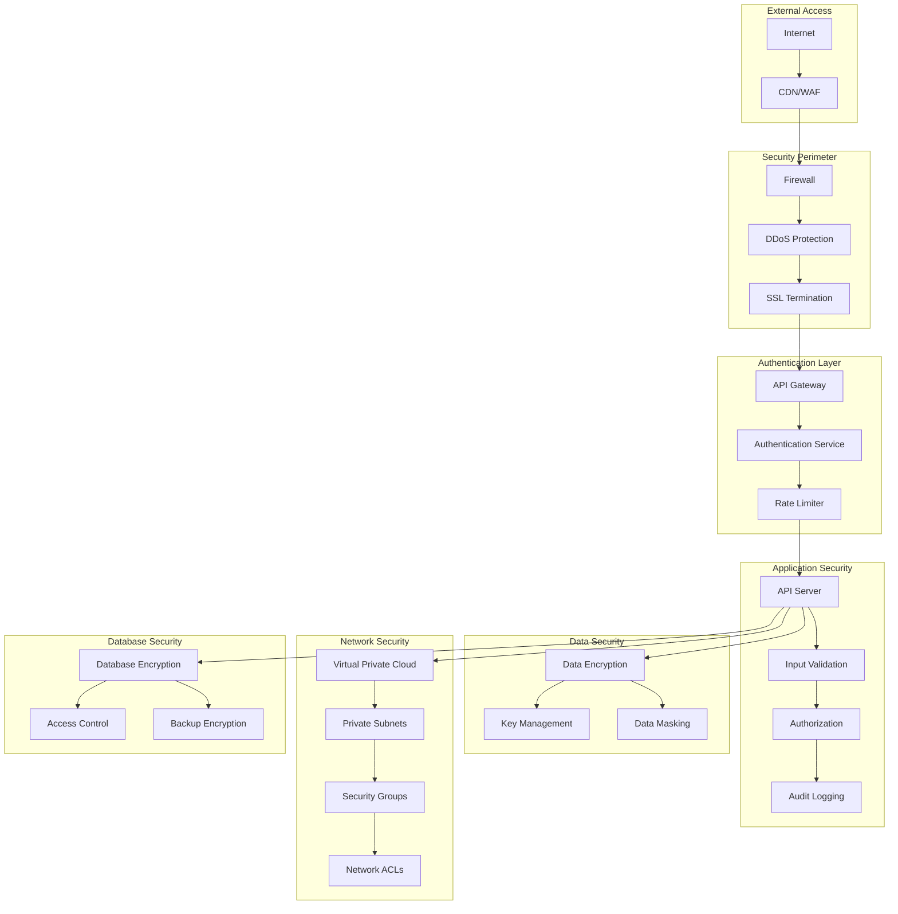

---

## Component Interaction Diagrams

### Session Lifecycle

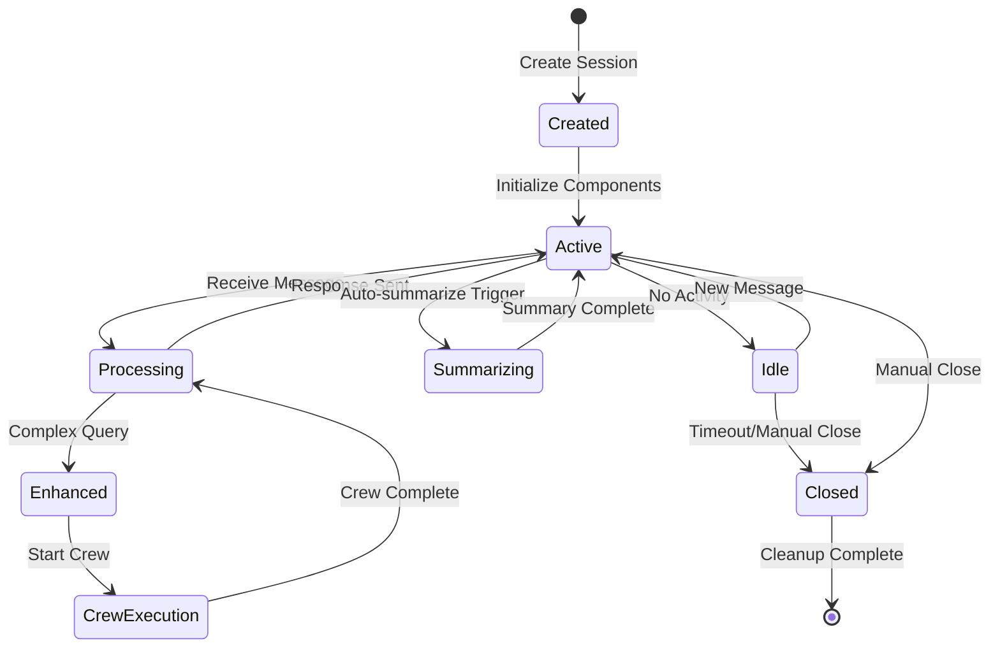

### Memory Layer State Transitions

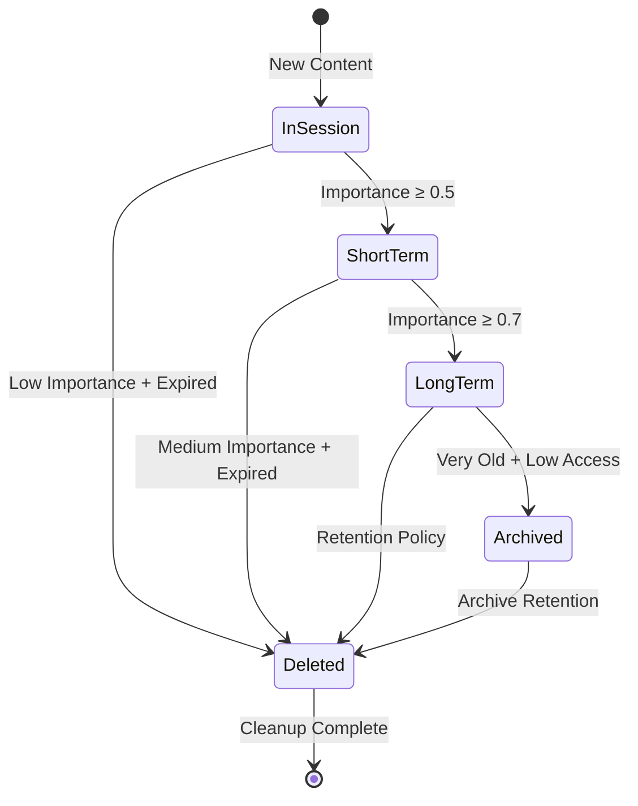

### Knowledge Source Integration

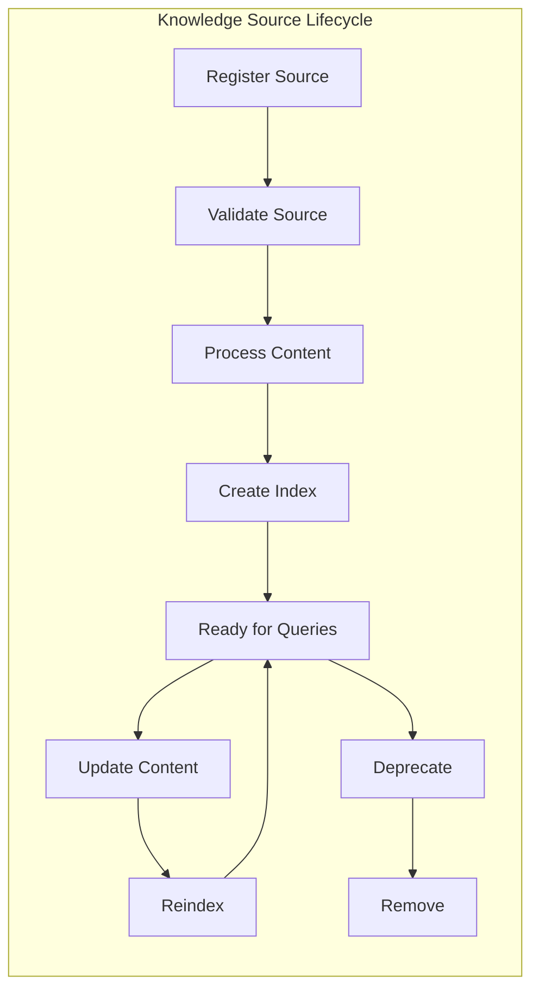

---

## Performance Monitoring Architecture

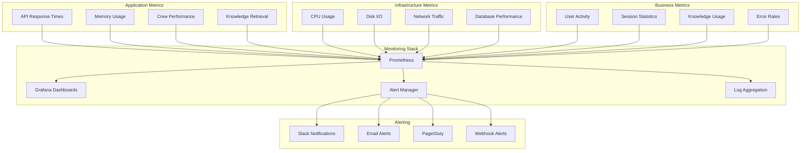

---

*These architecture diagrams provide comprehensive visual documentation of Golett AI's system design, data flows, and component interactions. They serve as reference materials for development, deployment, and maintenance activities.* 