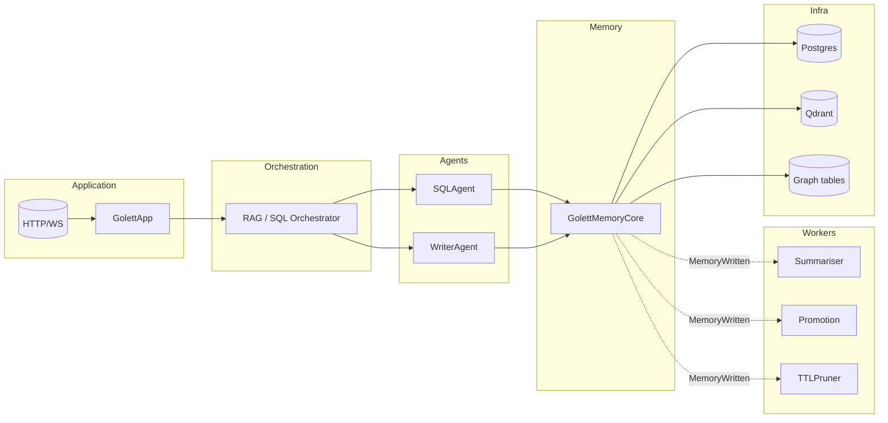

# Golett Gateway – Architecture Overview (July 2025)

This single document supersedes the older `FLOW.md` and `VNEXT_OVERVIEW.md`.
It captures **what the system is**, **how data flows**, and **where to extend**.

---
## 1. Purpose

Golett Gateway is a reusable core for building agent-driven chat products.
In this branch it powers a "Chat-to-Card" BI assistant that converts every
user question into a live Metabase card.

---
## 2. Layered view

---
## 3. Event-Driven runtime

See `docs/RUNTIME_FLOW.md` for the detailed Mermaid diagram and event list.
Key points:

* Internal **EventBus** replaces cron jobs.
* **AdaptiveScheduler** fans out events → workers in <1 ms.
* Context retrieval (`SessionContext.fetch`) auto-refreshes after every
  `MemoryWritten`.

---
## 4. Memory rings & promotion

| Ring        | TTL    | Purpose                          |
|-------------|--------|----------------------------------|
| in_session  | 1 h    | raw turns                        |
| short_term  | 7 days | per-topic summaries              |
| long_term   | ∞      | promoted stable knowledge        |

Promotion criteria live in `PromotionWorker` (importance ≥ 0.6 & age ≥ 5 min).

---
## 5. Extensibility quick-refs

* **Add a worker** – implement `interested_in()` + `run()`; register in
  `GolettBuilder`.
* **Swap vector DB** – implement `VectorStoreInterface` and pass to
  `with_vectors()`.
* **Bring your own orchestrator** – implement `OrchestratorInterface` and hand
  it to `GolettBuilder.with_orchestrator()`.

---
## 6. Document map

| Doc file | Role |
|----------|------|
| `ARCHITECTURE_OVERVIEW.md` | This high-level picture |
| `RUNTIME_FLOW.md` | Detailed event-driven sequence |
| `CLASS_DEPENDENCIES.md` | UML-style class diagrams |
| `MEMORY_KNOWLEDGE_INTERACTION.md` | Deep dive on memory vs knowledge |
| `ROADMAP.md` | Feature backlog & priorities |

Happy hacking!  All earlier scattered docs have been merged or removed to keep
knowledge in one place. 