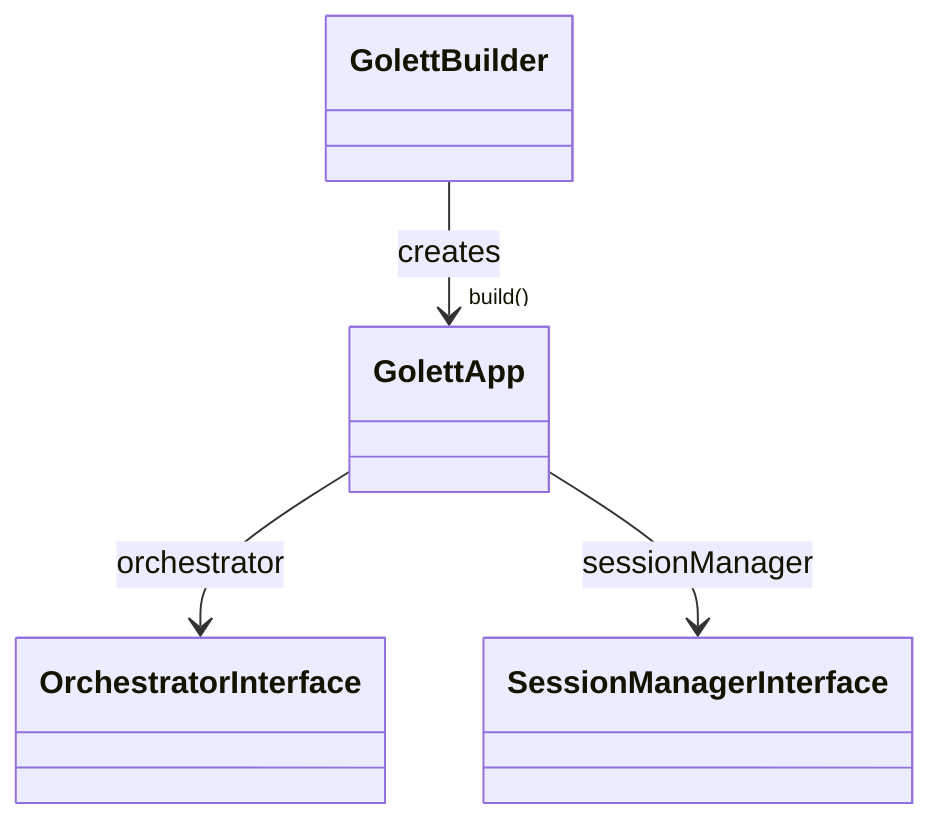
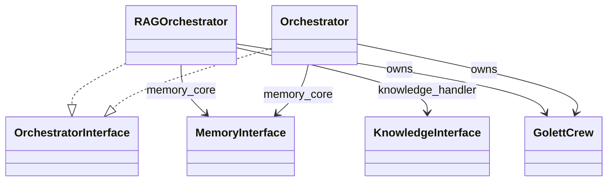
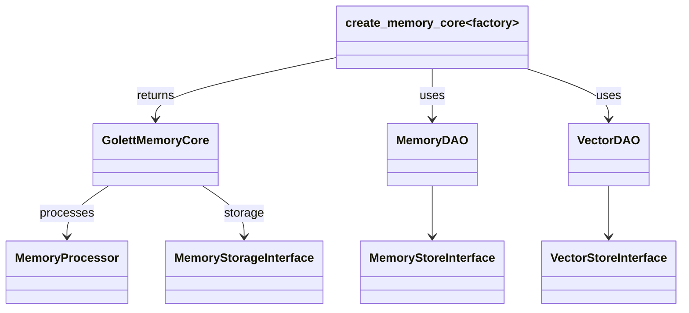
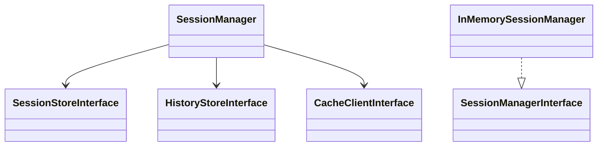
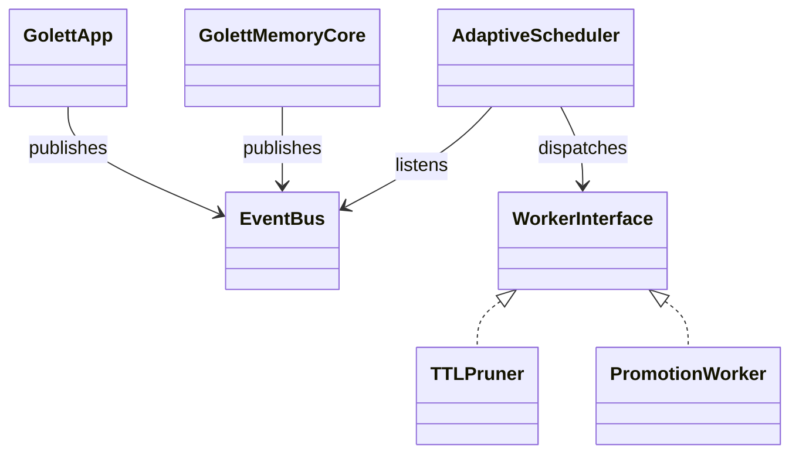

### Golett Core – Class Dependency Diagram

This document provides a **bird-eye view** of the most important classes inside
`golett_core` and the dependencies that connect them.  It focuses on the public
building blocks you will most often interact with when embedding Golett into an
application.  Internal helper classes (e.g. specific DAOs, processing workers)
are included where they help explain the data-flow.

---

#### 1. High-level overview

**Explanation**  
`GolettBuilder` is the fluent API that wires up sensible defaults (or custom
injections) and finally hands back a ready-to-use `GolettApp`.  At runtime the
app only needs two collaborators:

* an `OrchestratorInterface` implementation that decides **how to answer** a
  user message, and
* a `SessionManagerInterface` implementation that decides **where to store /
  retrieve** the conversation history.

---

#### 2. Orchestration layer

Two concrete orchestrators currently ship with Golett:

* **`Orchestrator`** – geared towards coding tasks (Planner ↔ Coder agents).
* **`RAGOrchestrator`** – geared towards knowledge-grounded Q&A (Researcher ↔ Writer agents).

Both orchestrators spin up a **`GolettCrew`** (a thin subclass of CrewAIʼs
`Crew`) and delegate memory persistence to the shared `MemoryInterface`.

---

#### 3. Memory subsystem

`GolettMemoryCore` is the single entry point for **all** memory operations: save
messages, build retrieval context, trigger summarisation …  The
`factory.create_memory_core()` convenience builds the dependency graph shown
above.

---

#### 4. Session & History

`SessionManager` is a persistence-agnostic façade that coordinates session
metadata and chat history.  When you do not need durability, an
`InMemorySessionManager` can be injected directly.

---

#### 5. Event-Driven runtime additions (2025-07)

**Explanation**  
The new `EventBus` is a lightweight pub/sub hub.  `GolettApp.chat()` and
`GolettMemoryCore.save_message()` push `NewTurn`, `AgentProduced`, and
`MemoryWritten` events onto the bus.  `AdaptiveScheduler` reads each event and
fires any `WorkerInterface` implementations whose `interested_in()` predicate
matches.  This replaces the earlier cron-style `SchedulerService`.

---

### Reading the diagrams

* **Solid arrows (→)** &nbsp;represent composition – the source class keeps a
  reference to the target class at runtime.
* **Dashed arrows (..|>)** &nbsp;represent an "implements / extends"
  relationship.
* Grey boxes labelled **~factory~** denote helper functions, not classes.

---

### How to extend

* Add a new orchestrator? → Make it implement `OrchestratorInterface` so
  `GolettBuilder` can accept it.
* Swap out memory backend? → Implement `MemoryStorageInterface` and pass it when
  constructing a `GolettMemoryCore`.
* Replace vector DB? → Provide a custom `VectorStoreInterface` to
  `VectorDAO`.

Keeping strict, minimal interfaces between layers is what allows each piece to
be replaced independently.

---

_Last generated automatically by analysing source on **2025-07-02**._ 