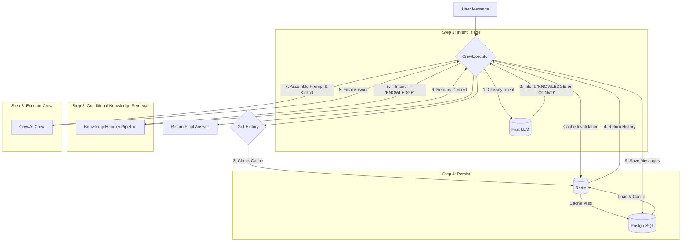

# Golett Core - Detailed Design

> **Version:** 2024-07-29
> **Status:** DRAFT

---

### 1. Core Philosophy

`golett_core` is a framework-agnostic Python library for orchestrating agentic chat applications with CrewAI. It is designed to be self-contained, with all dependencies and interactions with external services (databases, vector stores) explicitly injected. Its primary goal is to manage the complexity of state, memory, and knowledge, allowing for the creation of robust and stateful conversational AI.

---

### 2. Pydantic Schemas (Data Contracts)

These models define the core data structures passed between components. They ensure type safety and provide a clear, validated API.

```python
from pydantic import BaseModel, Field
from typing import List, Dict, Any, Literal
from datetime import datetime
import uuid

class Session(BaseModel):
    session_id: str = Field(default_factory=lambda: str(uuid.uuid4()))
    user_id: str
    created_at: datetime = Field(default_factory=datetime.utcnow)
    metadata: Dict[str, Any] = Field(default_factory=dict)
    
class ChatMessage(BaseModel):
    role: Literal["user", "assistant"]
    content: str
    timestamp: datetime = Field(default_factory=datetime.utcnow)

class KnowledgeDocument(BaseModel):
    doc_id: str = Field(default_factory=lambda: str(uuid.uuid4()))
    source_uri: str # e.g., "s3://my-bucket/documents/file.pdf"
    status: Literal["pending", "processing", "processed", "failed"] = "pending"
    user_id: str # To associate the document with a user
```

---

### 3. Component Deep Dive

#### 3.1. SessionManager

Handles the lifecycle and history of a conversation. It leverages a cache-aside pattern for rapid access to recent messages.

*   **Responsibilities**:
    *   Create, retrieve, and update session metadata.
    *   Append messages to the chat history for a given session.
    *   Retrieve the chat history for a session, using a cache to minimize database latency.
*   **Dependencies (Injected)**:
    *   `SessionStore`: An interface for persisting session metadata (e.g., PostgreSQL).
    *   `HistoryStore`: An interface for persisting chat messages (e.g., PostgreSQL).
    *   `CacheClient`: An interface for a key-value cache (e.g., Redis).
*   **Public Methods**:
    *   `create_session(user_id: str) -> Session`
    *   `get_session(session_id: str) -> Session`
    *   `add_message(session_id: str, message: ChatMessage)`: Writes to `HistoryStore` and invalidates the cache.
    *   `get_history(session_id: str, limit: int = 10) -> List[ChatMessage]`: Attempts to read from `CacheClient` first, falling back to `HistoryStore` on a miss.

#### 3.2. KnowledgeHandler

Manages the long-term, static knowledge base. It is responsible for the entire document lifecycle.

*   **Responsibilities**:
    *   Ingesting new documents from a source URI.
    *   Processing documents (parsing, chunking, embedding).
    *   Storing and indexing document chunks and their embeddings.
    *   Providing a retrieval interface for semantic search.
*   **Dependencies (Injected)**:
    *   `FileStore`: An interface to read files (e.g., from an S3 bucket).
    *   `VectorStore`: An interface to a vector database (e.g., Qdrant).
    *   `DocumentProcessor`: A utility to handle parsing and chunking of different file types.
*   **Public Methods**:
    *   `ingest_document(doc: KnowledgeDocument)`
    *   `get_retrieval_context(query: str, user_id: str, top_k: int = 5) -> List[str]`

#### 3.3. CrewExecutor

The main orchestrator. It connects sessions, knowledge, and agents to produce a response. It includes an intent triage step to avoid unnecessary work.

*   **Responsibilities**:
    *   Perform an initial triage on the user's query to determine intent.
    *   Conditionally invoke the `KnowledgeHandler` based on the intent.
    *   Assemble a CrewAI `Crew` with the necessary agents and tools.
    *   Fetch conversational memory (`SessionManager`).
    *   Kick off the crew and return the final result.
*   **Dependencies (Injected)**:
    *   `SessionManager`
    *   `KnowledgeHandler`
    *   `CrewFactory`: A factory to create and configure CrewAI crews.

---

### 4. The Relationship Between Knowledge and Memory

This is the critical interaction that makes the system intelligent.

*   **Knowledge (Long-Term Memory)**: The durable, explicit information store managed by the `KnowledgeHandler`. It is the "library" of facts, documents, and data that agents can consult. It is searched, not browsed.
*   **Memory (Short-Term & Conversational)**: This is the dynamic context of a single conversation, managed by the `SessionManager`. It has two key parts:
    1.  **Chat History**: The literal transcript of the conversation. It provides the immediate context of "what we were just talking about."
    2.  **Working Memory**: This is ephemeral, existing only for the duration of a single `crew.kickoff()`. It's the "mental scratchpad" where agents hold the information they are currently working with, including results from knowledge retrieval.

**Interaction Flow (Sequence Diagram with Intent Triage):**



This flow ensures that every agentic process is grounded in both the immediate conversational memory and the vast, searchable long-term knowledge base. 