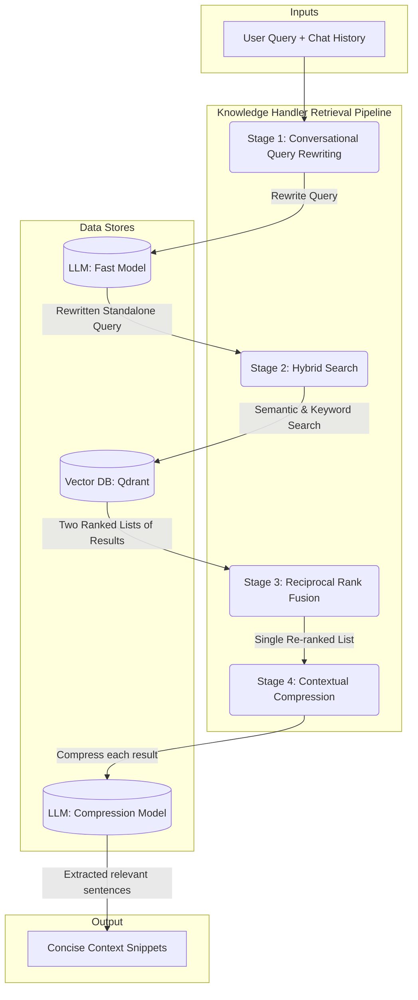

# Knowledge Handler - Deep Dive Design

> **Version:** 2024-07-29
> **Status:** DRAFT

---

### 1. Overview

The `KnowledgeHandler` is the core component responsible for bridging the gap between raw, unstructured user data (documents) and the actionable context required by CrewAI agents. It manages a complete lifecycle: ingesting documents, processing them into a searchable format, and providing a sophisticated retrieval pipeline to find relevant information.

This document details the internal design of both the ingestion and retrieval pipelines.

---

### 2. Document Ingestion Pipeline

This pipeline describes the asynchronous process that occurs after a user uploads a file to the designated file store (e.g., S3 bucket).

**Trigger**: A new file appearing in the bucket or an API call to `ingest_document`.

1.  **File Fetcher**: Retrieves the raw file (`.pdf`, `.docx`, etc.) from the `FileStore`.
2.  **Document Parser**: Detects the file type and uses a corresponding parser (e.g., `PyPDFLoader`, `UnstructuredFileLoader`) to extract its raw text content.
3.  **Text Chunker**: Employs a `RecursiveCharacterTextSplitter` to break the extracted text into small, semantically meaningful chunks (e.g., 512-1024 characters) with some overlap. This is crucial for retrieval accuracy.
4.  **Embedding Generation**: Each text chunk is passed to an embedding model (e.g., a sentence-transformer model like `all-MiniLM-L6-v2` or a more powerful API-based model) to create a vector representation.
5.  **Vector Store Writer**: The text chunk, its corresponding vector, and critical metadata are packaged into a Qdrant `Point` and upserted to the `VectorStore`.

#### Qdrant Point Schema

It is vital that the payload stored alongside the vector in Qdrant contains the necessary metadata for filtering and traceability.

```python
# Represents the payload of a single point in Qdrant
class KnowledgePoint(BaseModel):
    text: str  # The actual text chunk
    doc_id: str # The ID of the parent document
    source_uri: str # URI of the original file in the S3 bucket
    user_id: str # The user who owns this document
    chunk_index: int # The sequential index of the chunk within the document
```

---

### 3. Retrieval Pipeline (`get_retrieval_context`)

This is the synchronous pipeline executed for each user message to provide context to the `CrewExecutor`. It is a multi-stage process designed for maximum relevance.

#### Retrieval Pipeline Diagram


**Input**: `query: str` (the user's latest message), `user_id: str`, `chat_history: List[ChatMessage]`

**Output**: `List[str]` (a list of concise, relevant context snippets)

#### **Stage 1: Conversational Query Rewriting**

*   **Problem**: The user's query ("and the first one?") is often meaningless without conversation history.
*   **Solution**: We create a prompt that includes the chat history and the latest user query. This is sent to a fast, inexpensive LLM with a single instruction: "Rewrite the 'user' query to be a standalone question, incorporating context from the chat history."
*   **Example**:
    *   History: `[{"role": "assistant", "content": "I have two proposals for the marketing campaign."}, {"role": "user", "content": "tell me about the second one"}]`
    *   New Query: `what about the first one?`
    *   **Rewritten Query**: `What is the first proposal for the marketing campaign?`
*   All subsequent stages use this `rewritten_query`.

#### **Stage 2: Hybrid Search**

*   **Problem**: Semantic search can miss specific keywords, while keyword search misses conceptual matches.
*   **Solution**: We perform two searches in parallel against the `VectorStore` (Qdrant), both strictly filtered by `user_id`.
    1.  **Semantic Search**: Embed the `rewritten_query` and perform a vector similarity search.
    2.  **Keyword (Full-Text) Search**: Qdrant can be configured with a full-text index on the `text` field of the payload. We use this to search for keywords present in the `rewritten_query`.

#### **Stage 3: Reciprocal Rank Fusion (RRF)**

*   **Problem**: We have two separate lists of search results and need to merge them intelligently.
*   **Solution**: We use RRF to combine the lists. It's a simple but powerful algorithm that looks at the rank of each document in each list. The formula for a document's RRF score is `Σ(1 / (k + rank))`, where `k` is a small constant (e.g., 60). This prioritizes documents that appear high up in *both* result lists. We take the top `N` (e.g., 5) results from this fused list.

#### **Stage 4: Contextual Compression**

*   **Problem**: The retrieved chunks, while relevant, may contain a lot of fluff or irrelevant sentences, wasting precious context space in the final prompt.
*   **Solution**: For each of the top N fused results, we perform a final LLM call.
    *   **Prompt**: `[Original rewritten_query] \n\n [Retrieved document chunk text]`
    *   **Instruction**: "Extract only the sentences from the document text that directly answer or are relevant to the query. If no sentences are relevant, return an empty string."
*   This "compresses" the context, ensuring the final output is dense with relevant information.

#### **Final Output**

The pipeline returns a list of the non-empty, compressed context snippets, ready to be injected into the main agent crew's prompt. 