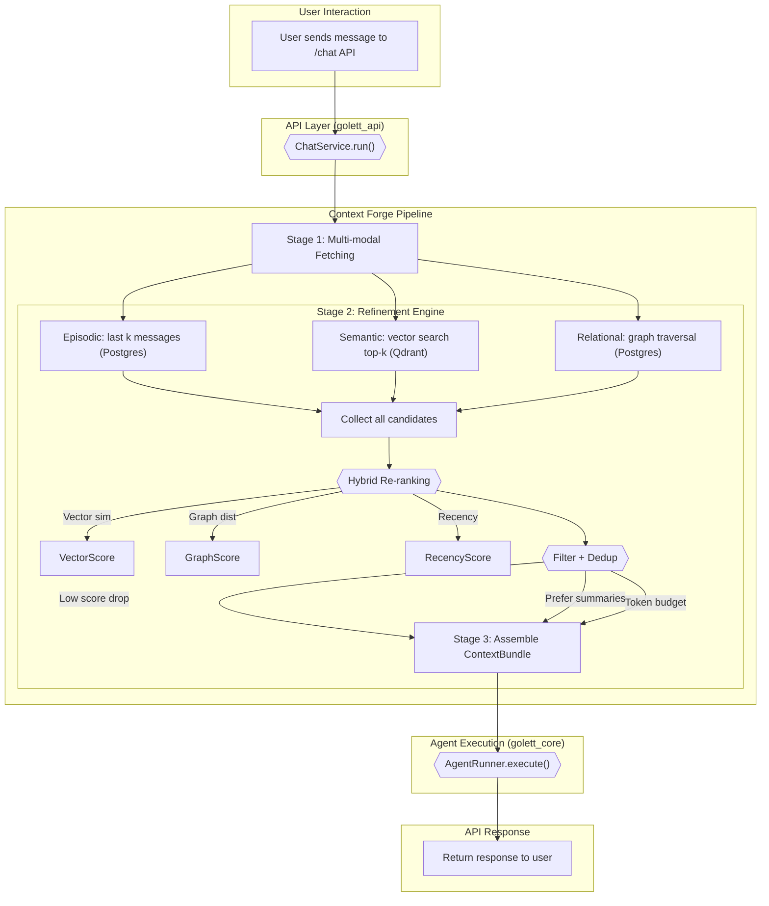
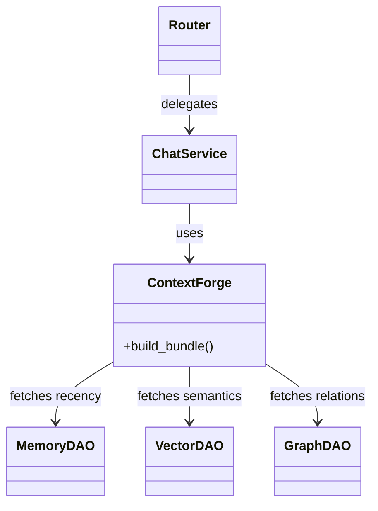
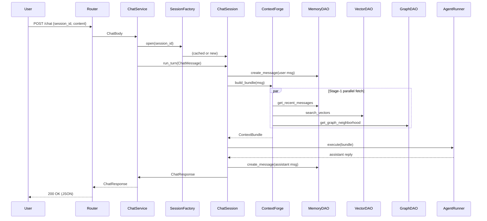

## Golett Gateway – Memory Mechanism Design

> **Version:** 1.0 – 2024-06-28
> **Owner:** Core AI Team

---

### 1. Guiding principles
1.  **Memory is Multi-modal:** Memory is not one thing. It's a combination of different types (episodic, semantic, relational) stored in the best-fit backend (Postgres for facts, Qdrant for similarity).
2.  **Context is Built, Not Found:** We don't just "find" context; we actively **build** it. Retrieval is a multi-stage process of fetching, filtering, re-ranking, and assembling information.
3.  **Traceable & Auditable:** Every piece of information in the final context bundle must be traceable to its source (a message ID, a document URI, a graph node). This is our "Evidence Lineage" principle.
4.  **Memory Evolves:** Memory is not static. It is actively managed through summarization, consolidation, and fading to keep it relevant and efficient.

---

### 2. Core data structures (`golett_core/schemas/memory.py`)
These Pydantic models are the canonical representation of memory.

**`MemoryItem`**: The fundamental, generic unit of stored memory.
```python
from enum import Enum
from pydantic import BaseModel, Field

class MemoryType(str, Enum):
    MESSAGE = "message"          # A raw chat message
    SUMMARY = "summary"          # A condensed summary of a conversation chunk
    ENTITY = "entity"            # A piece of knowledge about a named entity (e.g., a project)
    FACT = "fact"                # A verified, standalone piece of information
    PROCEDURE = "procedure"      # A learned multi-step process

class MemoryItem(BaseModel):
    id: UUID = Field(default_factory=uuid4)
    source_id: Optional[UUID] = None  # e.g., the message.id this memory was derived from
    session_id: Optional[UUID] = None
    type: MemoryType
    content: str                      # The textual content of the memory
    importance: float = 0.5           # LLM-assigned score (0.0 to 1.0) of this memory's value
    created_at: datetime = Field(default_factory=datetime.utcnow)
    last_accessed_at: datetime = Field(default_factory=datetime.utcnow)
    metadata: Dict[str, Any] = {}
```

**`ContextBundle`**: The final, assembled object passed to the agent for a given turn. This is the LLM's entire "world" for the current request.
```python
class ContextBundle(BaseModel):
    session_id: UUID
    current_turn: ChatMessage
    recent_history: List[ChatMessage]       # Last k turns (episodic memory)
    retrieved_memories: List[MemoryItem]    # From semantic/vector search (semantic memory)
    related_graph_entities: List[Node]      # From graph traversal (relational memory)
    relevant_metrics: Optional[MetricData]  # From Cube.js (domain-specific data)
    user_profile: Optional[UserProfile]     # Long-term user preferences
```

---

### 3. The Context Forge: A Detailed Retrieval Mechanism
The "Context Forge" is the heart of the memory system. It doesn't just *find* context; it actively **retrieves, refines, and assembles** it from multiple sources into a high-quality, coherent `ContextBundle` for the LLM.

#### 3.1 Flowchart: The Read Path / Context Forging Process


#### 3.2 Detailed Mechanism Breakdown (The Read Path)

**Stage 1: Multi-modal Fetching (Parallel Execution)**
The `ChatService` initiates three data retrieval operations **concurrently** using `asyncio.gather` to minimize latency.

1.  **Episodic Fetch (Postgres DAO):**
    *   **Action:** `get_recent_messages(session_id, limit=10)`
    *   **Purpose:** Provides immediate, turn-by-turn conversational context.

2.  **Semantic Fetch (Qdrant DAO):**
    *   **Action:** `search_vectors(collection, query_vector, top_k=15)`
    *   **Details:** We deliberately **over-fetch** to provide more candidates for the re-ranking engine. The `query_vector` is from the user's current message.
    *   **Purpose:** To find semantically related memories, facts, and conversation summaries.

3.  **Relational Fetch (Postgres Graph DAO):**
    *   **Action:** `get_graph_neighborhood(entity_ids, depth=2)`
    *   **Details:** A lightweight NLP model (e.g., `spacy`) extracts named entities (`entity_ids`) from the user's message to seed the graph traversal.
    *   **Purpose:** To discover hidden relationships between entities.

**Stage 2: The Refinement Engine (CPU-bound Logic)**
This stage forges a clean, relevant context from the raw candidates retrieved in Stage 1.

1.  **Candidate Collection:** All results are pooled into a single list.

2.  **Hybrid Re-ranking:** Each candidate is scored using a weighted formula. This is far more effective than relying on vector score alone.
    *   **Formula:** `final_score = (w_sem * sem_score) + (w_rec * rec_score) + (w_rel * rel_score)`
    *   **Dynamic Weighting:** The weights (`w_sem`, etc.) are **not static**. Before re-ranking, a classifier analyzes the user's intent. For a "who works on X?" query, the relational weight `w_rel` is boosted.

3.  **Filtering & Deduplication:** The ranked list is processed:
    *   **Relevance Threshold:** Items with a `final_score` below a threshold (e.g., 0.4) are discarded.
    *   **Summarization Preference:** If a raw message and a summary of it are both present, the raw message is removed. This drastically reduces token count.
    *   **Token Budgeting:** The top-ranked items are added to the context one by one until a token budget (e.g., 3000 tokens) is met.

**Stage 3: Bundle Assembly**
The `ChatService` assembles the final, clean list of memory items into the `ContextBundle` object, ready for the Agent Runner.

#### 3.3 The Write Path (Asynchronous Enrichment)
The write path remains as previously designed: an event-driven, asynchronous process using background workers for embedding, graph building, and summarization. This ensures that API response times are not affected by these heavier operations.

---

### 4. Why This Design is Production-Ready
*   **Optimized for Latency:** Parallel fetching minimizes I/O wait time.
*   **Reduces Noise:** The multi-stage refinement process actively combats the "context stuffing" problem that confuses LLMs.
*   **Intelligent and Dynamic:** Re-ranking with dynamic weights allows the memory system to adapt to the user's intent on a per-query basis.
*   **Token-Efficient:** The summarization preference and token budgeting rules ensure maximum signal for minimum cost.
*   **Extensible:** Adding a new memory source means adding a new fetcher to Stage 1 and a new term to the re-ranking formula.

---

### 5. Component interfaces (`golett_core/memory/interfaces.py`)
This defines the contracts our adapters must adhere to.

### 6. Class-level Design
This section translates the mechanism into concrete Python classes and where they live in the repo.  Uml-style ASCII diagram follows.

#### 6.1 Module Map
| Layer | Module Path | Key Classes |
|-------|-------------|-------------|
| Rings / Storage | `golett_core.memory.rings.*` | `InSessionStore`, `ShortTermStore`, `LongTermStore`, `MultiRingStorage` |
| Retrieval Pipeline | `golett_core.memory.retrieval.*` | `ContextForge`, `ReRanker`, `TokenBudgeter` |
| Processing Pipeline | `golett_core.memory.processing.*` | `LLMTagger`, `SummarizerWorker`, *(future)* `Fader` |
| Core Data | `golett_core.schemas.memory` | `MemoryItem`, `ContextBundle` |
| API | `golett_api.services.chat_service` | `ChatService` |
| API DAO | `golett_api.data_access.memory_dao` | `MemoryDAO` |
| Vector DAO | `golett_api.data_access.vector_dao` | `VectorDAO` |
| Workers | `golett_tools.workers.embedding_worker` | `EmbeddingWorker` |
| Workers | `golett_tools.workers.graph_builder` | `GraphBuilder` |
| Legacy | `golett_core.memory.legacy` | `engine.py`, `interfaces.py`, etc. |

#### 6.2 Class Responsibilities
1. **ChatService**
   * Orchestrates the full request flow.
   * Delegates context building to `ContextForge`.

2. **ContextForge**  (`golett_core.memory.retrieval.context_forge`)
   * Public API: `async build_bundle(message: ChatMessage) -> ContextBundle`.
   * Talks to **MultiRingStorage** for Stage-1 fetch (episodic, semantic, relational).
   * Delegates re-ranking to `ReRanker` and token pruning to `TokenBudgeter`.

3. **MultiRingStorage**
   * Facade that fans out calls to `InSessionStore`, `ShortTermStore`, and `LongTermStore`.
   * Collates results and preserves `metadata.lineage` for traceability.

4. **Ring Stores**
   * **InSessionStore** – raw chat turns (TTL ≈ 1 h, Postgres/Redis).
   * **ShortTermStore** – per-session summaries (vectorised).
   * **LongTermStore** – cross-session facts/entities/procedures (vectorised).

5. **Processing Pipeline**
   * **LLMTagger / RuleTagger** – classify each turn (`type`, `topic`, `importance`).
   * **MemoryProcessor** – decides whether a buffer should be summarised.
   * **SummarizerWorker** – converts buffered turns into a `SUMMARY` MemoryItem stored in ShortTerm/LongTerm.

6. **DAO layer**
   * **MemoryDAO** (relational) and **VectorDAO** (vector) wrap infrastructure specifics.

7. **Workers (infra)**
   * **EmbeddingWorker** – writes embeddings for new MemoryItems.
   * **GraphBuilder** – populates relational knowledge graph.

Legacy `engine.py` and original interfaces remain under `memory.legacy` until full migration.

#### 6.3 Class Diagram (Mermaid)


#### 6.4 Example Skeleton Code
```python
# golett_core/memory/engine.py
class ContextForge:
    def __init__(self, memory_dao: MemoryDAO, vector_dao: VectorDAO, graph_dao: GraphDAO,
                 reranker: ReRanker, budgeter: TokenBudgeter):
        self.mem = memory_dao
        self.vec = vector_dao
        self.graph = graph_dao
        self.rerank = reranker
        self.budget = budgeter

    async def build_bundle(self, message: ChatMessage, intent: str) -> ContextBundle:
        # Stage 1 fetch in parallel
        tasks = [
            self.mem.get_recent_messages(message.session_id, 10),
            self.vec.search_vectors("messages_vectors", message.embedding, 15),
            self.graph.get_graph_neighborhood(extract_entities(message.content), 2),
        ]
        recent, semantic, relational = await asyncio.gather(*tasks)

        # Stage 2 re-ranking / filtering
        candidates = list(chain(recent, semantic, relational))
        self.rerank.update_weights(intent)
        scored = [(self.rerank.score(c, message.embedding, intent), c) for c in candidates]
        scored.sort(reverse=True, key=lambda t: t[0])
        pruned = self.budget.prune([c for _, c in scored], budget_tokens=3000)

        # Stage 3 bundle assembly
        return ContextBundle(
            session_id=message.session_id,
            current_turn=message,
            recent_history=recent,
            retrieved_memories=pruned,
            related_graph_entities=[],
            relevant_metrics=None,
            user_profile=None,
        )
```

#### 6.5 End-to-End Memory–Session Interaction (Sequence)


*This sequence shows every major class involved in a single chat turn, highlighting the clear boundaries and responsibilities defined earlier.*

---
*End of class-level design.*

---

### 7. Putting It All Together – Memory Rings & Session Re-Open
The memory system operates as three concentric *rings*, each with its own storage, TTL, and retrieval strategy.

| Ring | Scope | Storage | TTL / Freshness | Loaded When |
|------|-------|---------|-----------------|-------------|
| **Domain KB** | Static docs, metric definitions, code snippets | Markdown/Parquet on S3 + embedding collection `kb_vectors` | Manual versioning | Agent startup only |
| **Long-term memory** | `FACT`, `