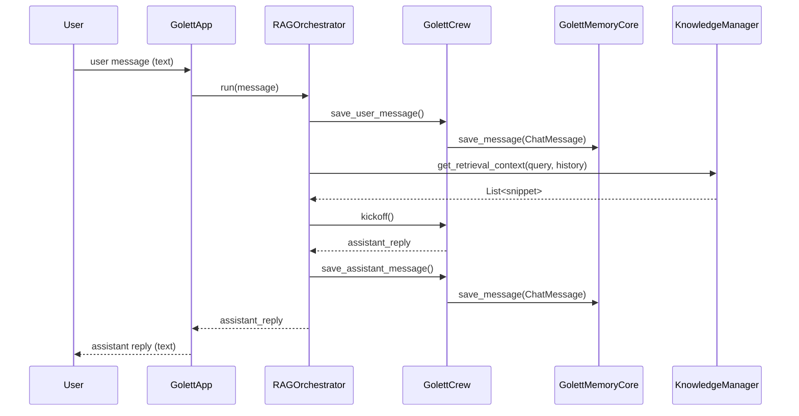
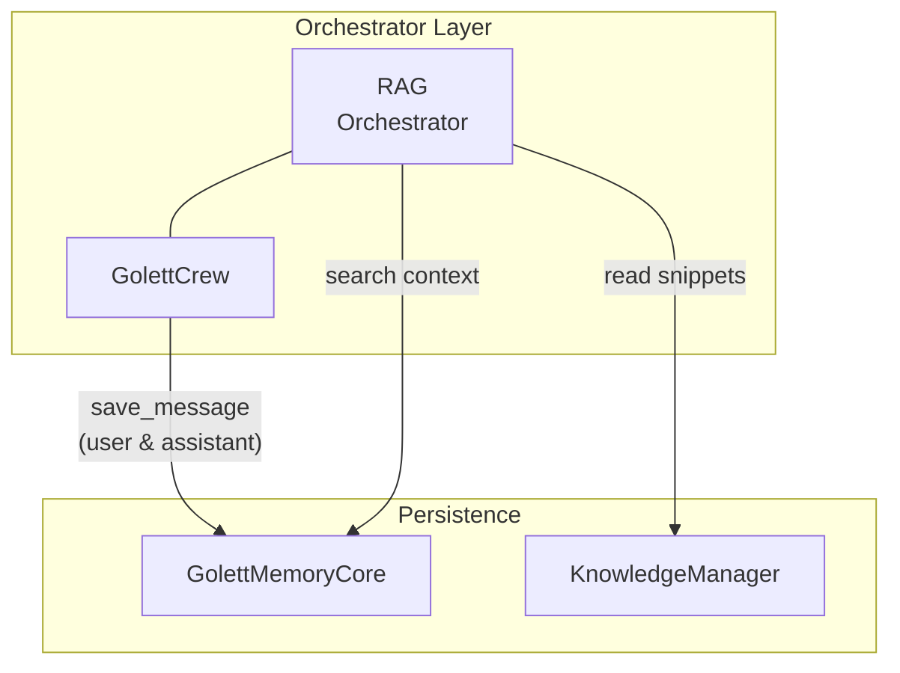

## Memory & Knowledge – Design and Interaction Guide

> **Version:** 2025-07-02  
> **Status:** Draft

---

### 1. Mental Model

| Aspect | Memory | Knowledge |
|--------|--------|-----------|
| **Scope** | Session-centric (per chat) | Corpus-centric (user or organisation) |
| **Typical Size** | O(10³) items / session | O(10⁶) chunks total |
| **Volatility** | High – messages arrive every turn, summaries fade | Low – documents ingested explicitly |
| **Primary Storage** | Postgres (rows) + Qdrant (vectors) | Qdrant only (vectors with metadata) |
| **Conceptual Role** | "What the user & bot just said / concluded" | "What the user already **knows**" |
| **Core Interface** | `MemoryInterface` | `KnowledgeInterface` |
| **Entry Point** | `GolettMemoryCore` | `KnowledgeManager` |

Despite different lifecycles, the two subsystems play complementary roles when
building the **context window** for the LLM.

> **July 2025 update:** All memory writes now publish a `MemoryWritten` event
> on the internal `EventBus`.  Workers such as `SummariserWorker` and
> `PromotionWorker` listen to that event (via `AdaptiveScheduler`) so
> summarisation and promotion happen *immediately* after the data change—no
> cron job required.

---

### 2. Data-flow at Runtime

#### 2.1 Sequence Diagram (RAG-oriented chat turn)



Key observations:

1. **Write-only vs Read-only** in this flow – memory is **written** for both user
   and assistant messages, while knowledge is **read** to augment the prompt.
2. The orchestrator remains the **only coupling layer**; `MemoryCore` and
   `KnowledgeManager` never call each other directly.

#### 2.2 Coding-oriented Orchestrator

For the Planner/Coder orchestration (`Orchestrator` class) the interaction is
slightly different:

* `MemoryCore.search()` is used to **read** recent history + semantic memories
  which become part of the crew context.
* Knowledge is *optionally* queried only when the plan indicates an explicit
  "research" requirement (not yet implemented, see §4).

#### 2.3 Component Interaction Graph



This diagram highlights the **write–read boundaries**:

1. `GolettCrew` only **writes** to memory via `save_message` helpers.
2. The orchestrator **reads** from both subsystems but is the sole mediator.
3. Memory and Knowledge remain decoupled, enabling independent scaling and replacement.

---

### 3. Interface Contracts

```python
class MemoryInterface(Protocol):
    async def save_message(msg: ChatMessage) -> None: ...
    async def search(session_id: UUID, query: str, *, include_recent: bool=True) -> ContextBundle: ...

class KnowledgeInterface(Protocol):
    async def ingest_document(doc: KnowledgeDocument) -> None: ...
    async def get_retrieval_context(query: str, user_id: str|None, chat_history: List[ChatMessage]|None, top_k: int=5) -> List[str]: ...
```

*Both* protocols hide infrastructure specifics; callers see only pure-Python
objects. This enforces testability and allows you to swap in-memory fakes for
unit tests.

---

### 4. Future Convergence Points

The current architecture keeps memory and knowledge strictly separated. The
following roadmap items will introduce deeper interplay:

1. **Memory → Knowledge Promotion**  
   High-importance `FACT` or `PROCEDURE` memories older than _N_ days will be
   *promoted* into the Knowledge vector store, turning ephemeral insights into
   durable organisational knowledge.
2. **Knowledge-aware Memory Summaries**  
   The `SummarizerWorker` will query Knowledge to anchor summaries with
   authoritative facts, reducing hallucination.
3. **Unified Graph Layer**  
   The planned `GraphStoreInterface` will allow both Memory and Knowledge items
   to appear as nodes/edges in a single knowledge graph for richer reasoning.

---

### 5. Extending or Replacing Either Side

* Swap the vector DB? → Implement `VectorStoreInterface` once and inject it into
  both `VectorDAO` (memory) **and** `KnowledgeManager`.
* Use a different summariser? → Provide a custom `SummarizerWorker` that is free
  to call Knowledge when generating summaries.
* Add user-specific access control? → Build that logic into
  `KnowledgeManager.get_retrieval_context()`; memory already scopes by
  `session_id`.

---

### 6. Glossary

* **Snippet** – A compressed chunk of document text returned by Knowledge.  
* **Memory Ring** – One of the three concentric stores (in-session, short, long).  
* **Promotion** – The act of turning a MemoryItem into a Knowledge chunk.

---

_Last updated: 2025-07-02_ 