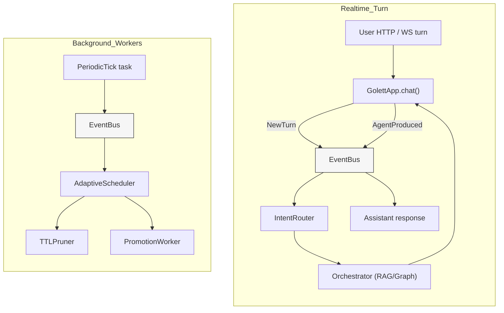

# Golett Gateway – Runtime Flow (Event-Driven, July 2025)

_Updated: 2025-07-04_

This document captures how the **event-driven** core in this build replaces
the previous timer-based worker model.  Read this together with
`ARCHITECTURE_OVERVIEW.md` for component details.

---
## 1. High-level data path



Legend:
* **EventBus** – single in-process `asyncio.Queue` with pub/sub helpers.
* **AdaptiveScheduler** – waits on EventBus; dispatches matching workers.
* **PeriodicTick** – optional safety net that keeps workers alive even if the
  chat is idle.

---
## 2. Key events

| Event               | Publisher                 | Typical Subscribers            |
|---------------------|---------------------------|--------------------------------|
| `NewTurn`           | `GolettApp.chat()`        | `IntentRouter`, analytics      |
| `AgentProduced`     | `GolettApp.chat()`        | frontend streamers, logging    |
| `MemoryWritten`     | `GolettMemoryCore.save_message` | `TTLPruner`, `PromotionWorker`, Context caches |
| `TokensExceeded`    | `TokenBudgeter`           | `SummariserWorker` (future)    |
| `PeriodicTick`      | `_ticker` task (10 min)   | Any worker that wants a fallback trigger |

Workers state their interest via:
```python
class MyWorker:
    def interested_in(self, ev):
        return isinstance(ev, (MemoryWritten, PeriodicTick))
```

---
## 3. Sequence of a single chat turn

1. **User** sends a message through the API layer.
2. `GolettApp.chat()`
   1. Saves the user `ChatMessage`.
   2. Publishes `NewTurn` on the bus.
3. `IntentRouter` consumes `NewTurn`, classifies intent, and the orchestrator
   builds the agent chain accordingly.
4. Orchestrator queries **MemoryCore/ContextForge** as needed.  Each call may
   write additional memories → `MemoryWritten` is published **immediately**.
5. Background workers (`TTLPruner`, `PromotionWorker`) see the event and
   run in **parallel** with the user-facing pipeline; no blocking occurs.
6. Orchestrator returns the assistant text → `GolettApp.chat()` publishes
   `AgentProduced` so streamers or logs can react.

Total extra latency seen by the user ≈ **0 ms** (all heavy work is async).

---
## 4. Disabling the timer entirely

If you want a _purely_ reactive system, comment out the `_ticker` coroutine in
`GolettBuilder.build()`.  All critical workers already wake on their data-level
triggers (`MemoryWritten`).  The periodic tick only provides a health guard in
idle environments.

---
## 5. Extending the flow

1. **Add a new worker** – implement `interested_in()` + `run()`;
   register it in `GolettBuilder`'s workers list.
2. **Publish a custom event** – define a `@dataclass` in `golett_core.events`
   and call `await bus.publish(MyEvent(...))`.
3. **Cross-process scaling** – replace the in-process bus with a Redis pub/sub
   channel; the `AdaptiveScheduler` code stays the same.

---
_That's it!_  The runtime is now fully event-driven, enabling near-instant
maintenance cycles and zero wasted CPU when chats are idle. 